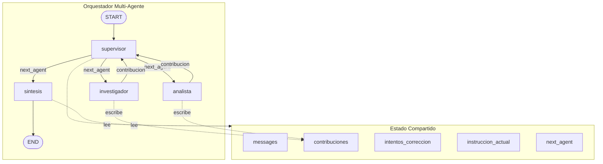

# Orquestador Multi-Agente Especializado

Sistema multi-agente en LangGraph: un **supervisor** (pasamanos que delega toda la
evaluación al LLM) coordina a dos agentes especialistas —`investigador` (ReAct +
RAG híbrido BM25/Pinecone) y `analista` (ReAct + calculadora segura)— y cierra
con un nodo de **síntesis** que redacta la respuesta final. Cada sesión deja una
traza en formato JSON Lines (`.jsonl`).

# Demo notebook/colab
demo_orquestador_colab.ipynb

# Compatibilidad

Python 3.12/3.13 (LangGraph 1.2+, LangChain 1.0+).

# Requisitos

```
poetry install
```

# Configurar

1. Copiar `config/.env.example` a `config/.env` y completar las API keys:

   - `GEMINI_API_KEY` (obligatoria)
   - `PINECONE_API_KEY` (obligatoria para `buscar_informacion`)

2. El resto de la configuración vive en `config/config.json`:

| Clave | Default | Para qué sirve |
|---|---|---|
| `model_name` | `gemini-3.1-flash-lite` | Modelo del LLM |
| `temperature` | `0.0` | Salida determinística |
| `max_tokens` | `512` | Tope de salida por invocación |
| `recursion_limit` | `15` | Corta el grafo externo antes de un loop infinito |
| `max_iterations_agentes` | `3` | Iteraciones máximas del bucle ReAct de cada agente |
| `max_tokens_contexto` | `6000` | Tope de tokens del historial que recibe cada agente |
| `max_intentos_correccion` | `3` | Intentos de corrección antes de forzar `sintesis` |
| `sqlite_db_path` | `orquestador.db` | Checkpointer (memoria entre turnos) |
| `trace_dir` | `trace` | Carpeta de trazas `.jsonl` |
| `data_dir` | `ingest/data` | Documentos fuente de la ingesta |
| `bm25_path` | `src/vectorstore/bm25_index.pickle` | Índice BM25 persistido |
| `embedding_model` | `models/gemini-embedding-001` | Embeddings (1536 dims) |
| `chunk_size` / `chunk_overlap` | `600` / `100` | Split de documentos en tokens |
| `top_k` / `score_threshold` | `5` / `0.75` | Recuperación y umbral de similitud |
| `index_name` / `namespace` | `cloudindex` / `multiagente` | Índice y namespace de Pinecone |

# Ingesta de datos

## Cargar

1. Copiar tus documentos (PDF, TXT, MD, JSON) a `ingest/data/`
2. `poetry run python -m ingest.ingest`
3. Verificar el log: `Ingesta finalizada: N fragmentos en el índice 'cloudindex' /
   namespace 'multiagente'` y que exista `src/vectorstore/bm25_index.pickle`
4. `poetry run python main.py`

El pipeline parte los documentos con `RecursiveCharacterTextSplitter`
(600 tokens / 100 de overlap), sube los chunks a Pinecone (`cloudindex`,
namespace `multiagente`) y serializa BM25 en `src/vectorstore/bm25_index.pickle`.

La ingesta se niega si Pinecone ya tiene datos **y** existe el pickle: corré
`ingest.delete` primero. El namespace se crea solo en el primer upsert. Hasta que
hagas la primera ingesta, `buscar_informacion` responde "sin resultados" y el
resto del grafo funciona igual.

## Eliminar

Vacía el namespace `multiagente` de Pinecone y borra el pickle BM25:

```
poetry run python -m ingest.delete        # pide confirmación [s/N]
poetry run python -m ingest.delete --yes  # sin confirmación
```

Ciclo para cambiar los documentos: `ingest.delete` → reemplazar archivos en
`ingest/data/` → `ingest.ingest` → `main.py`.

# Ejecutar

```
poetry run python main.py
```

```
[sesión] thread_id=sesion-afb062c695a6
[config] modelo=gemini-3.1-flash-lite | iteraciones por agente=3 | intentos máx=3

Escribí tu pregunta. 'salir', 'exit' o 'q' cierran la sesión.

Tú: Una API lee 400 millones de filas y escribe 20 millones al mes en DynamoDB ($0,125 y $1,25 por millón). ¿Cuánto cuestan las operaciones?

[supervisor] -> investigador: Busca y confirma la estructura de precios actual de DynamoDB para operaciones de lectura y escritura, específicamente validando si los precios de $0,125 por millón de lecturas y $1,25 por millón de escrituras son correctos para el modelo de capacidad bajo demanda o aprovisionada.

[supervisor] -> analista: Calcula el costo mensual total basado en los siguientes datos: 400 millones de lecturas a $0,125 por millón y 20 millones de escrituras a $1,25 por millón. Presenta el desglose de cada operación y la suma final.

[supervisor] -> sintesis: Redacta la respuesta final consolidando la información sobre el modelo de precios bajo demanda de DynamoDB y el desglose de costos calculado ($75,00 mensuales).

Agente: Para calcular el costo mensual de las operaciones en Amazon DynamoDB bajo el modelo de **capacidad bajo demanda**, hemos validado las tarifas y realizado el desglose correspondiente:

### Estructura de costos (Modelo bajo demanda)
*   **Lecturas:** $0,125 USD por millón de solicitudes.
*   **Escrituras:** $1,25 USD por millón de solicitudes.

### Desglose de costos mensuales
Basado en un volumen de 400 millones de lecturas y 20 millones de escrituras al mes, el cálculo es el siguiente:

| Operación | Volumen | Tarifa (por millón) | Costo Total |
| :--- | :--- | :--- | :--- |
| **Lecturas** | 400 millones | $0,125 | $50,00 |
| **Escrituras** | 20 millones | $1,25 | $25,00 |
| **Total** | | | **$75,00** |

**Resumen:** El costo mensual total por las operaciones de lectura y escritura especificadas es de **$75,00 USD**.

*Nota: Este cálculo contempla exclusivamente las operaciones de lectura y escritura. No incluye costos adicionales por almacenamiento de datos, transferencias de red o copias de seguridad, los cuales se facturan por separado según el uso real.*

Tú: salir
```

`salir`, `exit` o `q` cierran la sesión. Cada sesión usa un `thread_id` nuevo
(memoria limpia) y escribe su propio `trace/trace_<thread_id>.jsonl`.

Al salir se pregunta `¿Ver la traza en pantalla? [s/N]`: con `s` muestra la
sesión en texto legible (Enter sale sin mostrarla). El `.jsonl` no se modifica.

# Arquitectura



| Componente | Tipo | Herramientas | Bucle interno | Control iteraciones |
|---|---|---|---|---|
| `supervisor` | función pura async (pasamanos) | No | No | No aplica |
| `investigador` | `create_react_agent` | `buscar_informacion` | Sí (ReAct) | `max_iterations=3` |
| `analista` | `create_react_agent` | `calculadora` | Sí (ReAct) | `max_iterations=3` |
| `sintesis` | función pura async | No | No | No aplica |
| `tools` | `ToolNode` (`handle_tool_errors=True`) | Todas | No | No aplica |

Reglas del grafo:

- **Solo `sintesis` conecta con `END`.**
- El supervisor **no** decide con `if/else` sobre el texto: lee las
  contribuciones, detecta errores y devuelve `SupervisorOutput`
  (`next`, `instruccion`, `razon`) con `with_structured_output`.
- El código del supervisor solo **cuenta** intentos; el prompt define que al
  llegar al límite se elige `sintesis`, y Python hace de red de seguridad
  (si el LLM alucina, se fuerza `sintesis`).
- Cada agente recibe `SystemMessage(instruccion_actual)` + historial truncado
  con `trim_messages`: **nunca** la metadata del sistema ni las contribuciones
  de otros agentes.

## Topología

### Jerarquia con supervisor

1. **Simplicidad**: Un solo punto de decisión (supervisor) en lugar de coordinación peer-to-peer entre agentes
2. **Control centralizado**: El supervisor tiene visibilidad global del estado y las contribuciones
3. **Escalabilidad**: Agregar un nuevo especialista solo requiere crear su agente y añadir una ruta en el supervisor
4. **Traza clara**: Cada decisión del supervisor queda registrada en la traza JSON Lines

### Detalles del supervisor

El supervisor **no implementa lógica de decisión en código** (if/else sobre el texto). Toda la evaluación la hace el LLM con `with_structured_output(SupervisorOutput)`. El código solo:

- Cuenta intentos de corrección (`intentos_correccion`)
- Aplica la red de seguridad (llegó al límite → fuerza `sintesis`)

### Manejo de conflictos

| Conflicto | Mecanismo | Dónde |
|-----------|-----------|-------|
| **Bucle infinito** | `max_intentos_correccion=3` + red de seguridad en código | `src/nodes.py:110` |
| **Contaminación de contexto** | Cada agente recibe solo `instruccion_actual` + historial truncado con `trim_messages` | `src/agents/__init__.py:78` |
| **Contribuciones incompletas** | El supervisor detecta errores (regla 8 del prompt) y manda a corregir | `src/nodes.py:32` |
| **Turnos anteriores** | `contribuciones_del_turno()` filtra por `metadata["pregunta"]` | `src/state.py:69` |
| **Falla de API** | `invocar_con_reintentos()` con 1 reintento | `src/providers/gemini.py:42` |
| **Falla de herramienta** | `ToolNode` con `handle_tool_errors=True` | `src/graph.py:50` |

## Estado (`src/state.py`)

| Campo | Reducer | Significado |
|---|---|---|
| `messages` | `add_messages` | Historial; el último mensaje humano es la pregunta en curso |
| `contribuciones` | `operator.add` | Aportes de los agentes, cada uno etiquetado con su pregunta |
| `intentos_correccion` | sobrescribe | Intentos de corrección (se reinicia en cada turno) |
| `instruccion_actual` | sobrescribe | Instrucción del supervisor para el agente siguiente |
| `next_agent` | sobrescribe | Campo transitorio que consume la arista condicional |

`contribuciones_del_turno()` filtra por `metadata["pregunta"]`, así los turnos
anteriores de la misma sesión no contaminan la evaluación del supervisor ni la
respuesta final.

## Control de errores (tres capas)

| Capa | Control |
|---|---|
| Grafo | Reintento de API: `invocar_con_reintentos` (1 intento + 1 reintento) en supervisor, síntesis y agentes |
| Agente | `ToolNode` con `handle_tool_errors=True` + `max_iterations=3` por agente |
| Supervisor | Ciclo de corrección: si una contribución viene con `ERROR` o incompleta, manda a corregir hasta `max_intentos_correccion` |

Si todo falla, `main.py` registra el evento `error` en la traza y el chat sigue
activo.

# Herramientas

| Herramienta | Argumentos | Qué hace |
|---|---|---|
| `buscar_informacion` | `query: str` | Retriever híbrido: Pinecone (denso, peso 0.5) + BM25 (disperso, peso 0.5) con Reciprocal Rank Fusion, filtrado por `score_threshold` |
| `calculadora` | `expresion: str` | Evalúa `+ - * / **` y paréntesis con `ast` seguro (sin `eval`), con límite de exponente y detección de no-finítos |

Ambas tienen docstrings descriptivas: el LLM decide cuándo usarlas a partir del
texto del tool schema.

# Pinecone

| Parámetro | Valor |
|---|---|
| Índice | `cloudindex` (serverless, AWS `us-east-1`, métrica `cosine`) |
| Namespace | `multiagente` (se crea en la ingesta) |
| Embeddings | `models/gemini-embedding-001`, 1536 dimensiones |
| Umbral | `score_threshold = 0.75` sobre `top_k = 5` |

# Traza ReAct (JSON Lines)

Cada sesión escribe `trace/trace_<thread_id>.jsonl`: **una línea JSON por
evento**, agregada al final (append nativo, sin reescribir el documento, sin
bloquear el event loop gracias a `aiofiles`). El repositorio incluye dos trazas
reales de ejemplo.

| `tipo` | Qué registra |
|---|---|
| `sesion` | `thread_id` y parámetros de la sesión |
| `entrada_usuario` | Lo que escribió la persona |
| `pensamiento` | Decisión del supervisor (`ruta` = a quién despacha, `decision` = instrucción, `intentos_correccion`) |
| `contribucion` | Aporte del agente (`clase` = `datos`/`calculo`) y su `contenido` |
| `accion` | Tool call del agente y sus argumentos |
| `observacion` | Resultado que devolvió la herramienta |
| `respuesta_final` | Respuesta redactada por `sintesis` |
| `error` | Excepción de la sesión; el chat sigue vivo |

Todos los eventos llevan `n`, `ts` y `turno`. Fragmento real:

```json
{"n": 9, "ts": "2026-09-28T17:48:12", "turno": 1, "tipo": "accion", "nodo": "analista", "herramienta": "calculadora", "argumentos": {"expresion": "250 * 0.15"}}
{"n": 10, "ts": "2026-09-28T17:48:12", "turno": 1, "tipo": "observacion", "nodo": "tools", "herramienta": "calculadora", "resultado": "37.5"}
```

# Estructura

```
main.py                    CLI: .env/config, grafo, bucle de chat y escritura de la traza
pyproject.toml             dependencias (Poetry)
config/config.json         configuración central
config/.env.example        plantilla de API keys
src/state.py               CustomState (MessagesState + contribuciones + control)
src/tools.py               buscar_informacion (RAG) y calculadora (AST seguro)
src/nodes.py               nodo_supervisor (pasamanos) y nodo_sintesis
src/graph.py               StateGraph, nodos, arista condicional y ToolNode
src/trace.py               Traza JSON Lines (.jsonl)
src/agents/                investigador y analista (create_react_agent)
src/providers/gemini.py    cliente Gemini + invocar_con_reintentos
src/vectorstore/rag_system.py  RAG híbrido (Pinecone + BM25 + EnsembleRetriever)
src/schema/models.py       SupervisorOutput, ConfigParams y carga de config
ingest/ingest.py           pipeline de ingesta (PDF/TXT/MD/JSON)
ingest/delete.py           vaciado del namespace de Pinecone y del pickle BM25
ingest/data/               documentos fuente
trace/                     trazas de sesión (.jsonl)
```

# Notas de diseño

1. **Nodos puros**: no mutan el estado ni usan variables globales; todo efecto
   vuelve como retorno del nodo.
2. **Asincronía**: I/O con `await` (`aiofiles`, `ainvoke`, `asyncio.to_thread`
   para la consola y para el retriever).
3. **Supervisor es pasamanos**: delega toda la evaluación al LLM; el código solo
   cuenta intentos y aplica la red de seguridad.
4. **Mejora 1 — limpieza de mensajes**: la respuesta JSON del supervisor **no**
   se agrega a `state["messages"]`.
5. **Mejora 2 — rutas ligeras**: `next_agent` es transitorio (sobrescribe, no
   acumula) y lo consume la arista condicional.
6. **Mejora 3 — trazas JSON Lines**: append incremental en `.jsonl` en lugar de
   reescribir un JSON completo.
7. **`max_iterations`**: `create_react_agent` de LangGraph ≥ 0.6 no expone ese
   parámetro; `src/agents` lo aplica vía `recursion_limit = 2 * max_iterations + 1`
   (2 pasos por iteración ReAct + 1), lo que permite `max_iterations` rondas de
   herramientas antes de cerrar sin `GraphRecursionError`.

# Autor

Santiago Otero
